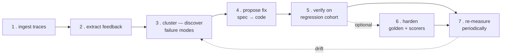
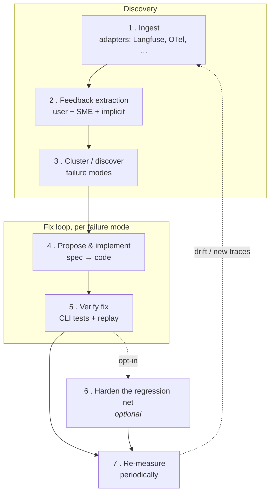
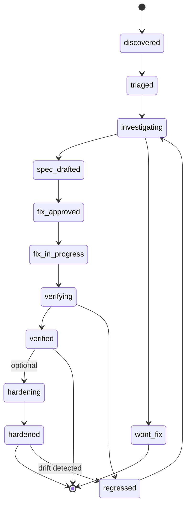

# Whetstone — Product Requirements Document

**Status:** Draft v0.1
**Owner:** Alfonso Graziano
**Last updated:** 2026-04-26

---

## 1. Summary

**Whetstone** is a semi-automatic improvement loop for LLM-based agents. It ingests live production traces from any telemetry provider, harvests feedback (user signals + subject‑matter‑expert annotations), uses a coding agent to discover and maintain a catalogue of **failure modes**, then proposes, implements, and *verifies* fixes against the agent under test.

The end state is a closed loop:



Whetstone is opinionated about the *workflow*, but **agnostic about**:

- the telemetry source (Langfuse, LangSmith, Maxim/MaxDraw, Phoenix, raw OTel, custom JSON dumps)
- the feedback signal (thumbs, comments, ratings, behavioural signals like clicks / conversation length / regenerations / abandonment, SME rubrics)
- the agent under test (any HTTP-callable agent, CLI agent, or codebase the coding agent can edit)
- how fixes are tested (the user provides CLI tools via a Markdown config; Whetstone just orchestrates them)

---

## 2. Problem & motivation

Teams ship LLM agents and then operate them blind:

- Telemetry is collected but rarely *closed back* into the development loop.
- Failure modes are discovered ad-hoc — usually by a single engineer scrolling Langfuse on a Friday afternoon.
- Fixes are one-off and rarely regression-tested against the trace that motivated them.
- SME review effort is expensive and gets thrown away after a single Slack comment.

Whetstone turns "looking at traces" into a structured, persistent artifact (`failure_modes.json`) that a coding agent can act on, and turns "did the fix work?" into a runnable check.

---

## 3. Goals & non-goals

### Goals

1. **Provider-agnostic ingest.** Pluggable adapters; one canonical internal trace shape.
2. **Unified feedback model.** User signals and SME annotations live in the same array, distinguished by a `source` field.
3. **Persistent, mergeable failure-mode catalogue.** `failure_modes.json` is the single source of truth, batch-updated, never overwritten blindly.
4. **Bidirectional links.** Each trace knows which failure modes it exemplifies; each failure mode knows its evidence traces.
5. **Spec-driven fixes.** Every proposed fix lands as a spec the user can review *before* code changes.
6. **Verifiable fixes.** A failure mode is only "closed" when a user-defined CLI test passes against the patched agent on the original failing cohort.
7. **Human-in-the-loop by default.** Every state transition (new failure mode, proposed fix, "verified") is reviewable.
8. **Lock the lesson in (optional).** Once a fix is `verified` against its regression cohort, the user can run the optional `harden` skill to propose a golden dataset entry and a matching scorer (deterministic or LLM-as-judge), so the same regression cannot return silently. Recommended for high-impact failure modes; skippable for one-off bugs.

### Non-goals (v1)

- Real-time/online learning or RLHF-style fine-tuning.
- Replacing the telemetry vendor — we *read from* it.
- Hosting / running the agent under test. The user owns the agent process.
- **Auto-creating commits, pushes, or PRs.** Skills edit files and run tests; they leave the working tree ready and stop. The user decides when (and whether) to commit, push, or open a PR. Whetstone never reaches into shared state on its own.

---

## 4. Personas

| Persona | What they do in Whetstone |
|---|---|
| **Agent engineer** | Owns the agent codebase. Reviews failure modes, approves fix specs, merges PRs. |
| **SME / annotator** | Reviews a sampled slice of live traffic and writes structured annotations. Never touches code. |
| **Ops / on-call** | Watches the dashboard for new high-severity failure modes; triages. |
| **The coding agent** | Runs the analysis and fix skills. Reads traces, writes failure modes, drafts specs, implements code, runs tests. |

---

## 5. End-to-end workflow



### 5.1 Ingest

- **Adapters** are tiny shims that pull traces from a provider and normalise them to the `Trace` schema (§7.1).
- Each adapter is responsible for: pagination, dedup (by `provenance.external_id`), incremental cursors.
- Output: a **new JSONL file** under `traces/`, named by the adapter convention (e.g. `traces/langfuse-2026-04-26.jsonl` or `traces/langfuse-2026-04-26-101433.jsonl` if multiple runs in a day). One ingest run = one file. Files are treated as immutable inputs once written; later enrichment (the analyze skill adding `failure_mode_ids[]`) rewrites lines in place inside whichever file holds the trace.
- Why per-run files instead of one big append-only file: easier to reason about ("analyze yesterday's Langfuse pull"), easier to diff and review, lets the user mix sources (one file from Langfuse, one from a CSV import, one from an OTel dump) without losing provenance.
- Filename convention is a default, not a requirement. The user can drop their own JSONL files into `traces/` (e.g. an SME-curated batch) and analyze them like any other.

### 5.2 Feedback extraction

- Feedback is **always in `trace.feedback[]`** — never a separate file.
- The adapter populates whatever signals the provider exposes (thumbs, ratings, comments).
- Behavioural signals (e.g. "user regenerated", "session > 10 turns", "user abandoned") are derived by extractor functions configured per project. Each derived signal becomes a `feedback` entry with `source: "implicit"` and a `derivation` block describing how it was computed.
- **SME annotations** are written by humans through whatever UI the team prefers (a sidecar app, a Linear-style tool, even a spreadsheet importer). They land as `feedback` entries with `source: "sme"`.

### 5.3 Cluster / failure-mode discovery

- The `analyze-traces` skill (§9.1) takes **a single file under `traces/`** as its input and processes it in **batches of N** (default 20, configurable). One invocation = one file.
- For each batch within the chosen file the skill:
  1. Reads the current `failure_modes.json`.
  2. Reads the next slice of unanalyzed traces from the file (those with `analysis.status = "pending"` and at least one negative or SME signal — configurable).
  3. For each trace, decides whether it matches an *existing* failure mode, refines/splits an existing one, or creates a new one.
  4. Writes back: enriches the trace with `failure_mode_ids[]` (in place, in the same file) and updates `failure_modes.json` (counts, sample trace IDs, last_seen, etc.).
- Batches are deterministic: same input file + same starting `failure_modes.json` should produce roughly the same result. The skill is instructed to **prefer reusing an existing failure mode** over inventing a new one (anti-fragmentation bias).
- Running `analyze-traces` over multiple files = invoking the skill multiple times. The user controls the order and pace.

### 5.4 Propose & implement fix

- The `fix-failure-mode` skill (§9.2) takes one failure mode at a time.
- It reads: failure-mode entry, all linked traces, the agent's source code, and the project's Markdown config.
- It writes a **spec file** (`failure_modes/<id>/SPEC.md`) describing the proposed fix in problem-space terms — *before* touching code.
- On user approval, it implements the change in a feature branch, and runs the lint/typecheck/unit tests defined in the project.

### 5.5 Verify fix

- Each failure mode carries a `tests[]` array (§7.2). Each test is a CLI invocation defined by the user in the Markdown config (e.g. `npm run agent:eval -- --scenario customer-refund-flow`).
- The verifier runs the tests against the *patched* agent and against the original cohort of failing traces (replayed via a user-provided replay command).
- Pass + cohort failure-rate below `metrics.target` ⇒ status moves to `verified`. Regression on a previously-verified failure mode ⇒ status flips to `regressed` and on-call is notified.

### 5.6 Harden the regression net *(optional)*

This step is **opt-in**. It only runs after §5.5 has confirmed the fix actually solved the failure on its regression cohort — there's no point hardening a fix that doesn't work. For one-off bugs the user can skip it; for failure modes that hurt or that you expect to recur, run it.

Once a fix is `verified`, the bug is fixed *for now*. But nothing yet prevents it from coming back silently the next time someone edits the prompt or a tool. This step turns the lesson into a permanent fixture in the agent's eval suite.

The `harden` skill (§9.3) takes the failure mode and proposes two artifacts:

1. **Golden dataset entries** — one or more canonical input/expected-output pairs, distilled from the linked traces. The agent picks 1–N representative traces (favouring SME-annotated ones), constructs a clean input (PII redacted, irrelevant context stripped), and writes an `expected` clause. `expected` is one of:
   - `exact` — the assistant's final message must match a string / regex,
   - `structural` — assertions over the trace structure (e.g. "must contain a tool_call where name == 'issue_refund'", "must NOT contain a refund confirmation without a preceding successful tool_call"),
   - `rubric` — a short rubric the LLM-as-judge scorer will evaluate against.
2. **Scorer additions or changes** — concrete proposals for what to add to `evals/scorers/`:
   - **Deterministic scorers** when the failure has a structural signature the verifier can check without an LLM (missing tool call, malformed JSON, latency budget, banned phrase).
   - **LLM-as-judge scorers** when the failure is semantic (factuality, tone, hallucinated side-effects). The skill writes a judge prompt + rubric, not just "ask an LLM if this is good".

Both are written into the failure mode's `regression_net` block (§7.2) as **proposals**. Nothing lands in `evals/` until a human approves. On approval the skill writes the files into `evals/`, runs the new scorers against the regression cohort to confirm they would have caught the original failures, and flips the failure mode's status from `verified` to `hardened`. It does **not** commit, push, or open a PR — the working tree is left ready and the user decides what to do with it.

The point of the split: the fix work demonstrates that the bug is solved *today*; the harden work ensures it stays solved. Whether the two ship together, separately, or not at all is the user's call. Failure modes that stop at `verified` are perfectly valid — they just don't grow the regression net.

### 5.7 Re-measure

- Periodically re-runs §5.5 across all `verified` and `hardened` failure modes to detect drift as the agent and its prompts evolve.
- For `hardened` failure modes, re-measurement *also* runs the scorers/golden entries from §5.6 — so the regression net grows monotonically and gets exercised on every CI run, not just when the originating failure mode is touched.

---

## 6. System architecture

Whetstone ships as **skills + a small CLI + a directory of artifacts**. No server, no DB in v1.

The three layers split along a clear seam: **skills** do the LLM-driven judgment work (analyze, fix, harden); the **CLI** does the deterministic plumbing (init, validate, query); the **artifacts** are the data, living in the agent's repo as diffable, reviewable files. Skills call the CLI as a subroutine; the user calls either directly.

```
whetstone/
├── whetstone.config.md            # human-authored config (eval commands, replay cmd, hard rules, …)
├── traces/                        # one immutable JSONL file per ingest run; pick one to analyze
│   ├── langfuse-2026-04-26.jsonl
│   ├── langfuse-2026-04-27.jsonl
│   └── otel-2026-04-27.jsonl
├── failure_modes.json             # the catalogue
├── failure_modes/
│   └── fm_2026_04_hallucinated_sku/
│       ├── SPEC.md                # fix spec (drafted by agent, reviewed by human)
│       ├── PLAN.md                # implementation plan (optional)
│       ├── tests.json             # bound test definitions
│       └── runs/                  # historical verifier runs
├── adapters/                      # provider adapters (small TS scripts the user runs / a skill calls)
│   ├── langfuse.ts
│   ├── otel.ts
│   └── ...
├── skills/                        # skills (markdown), portable across coding assistants
│   ├── ingest-traces.md           # wraps the adapter scripts
│   ├── analyze-traces.md
│   ├── fix-failure-mode.md
│   ├── verify-failure-mode.md
│   ├── harden.md                  # optional: golden + scorers proposer
│   └── status.md                  # read-only catalogue summary
└── .whetstone/
    ├── cursors.json               # per-adapter ingest checkpoints
    └── batches/                   # per-batch logs from the analyze skill
```

### 6.1 Skills (LLM judgment work)

Each pipeline stage that requires reading transcripts, classifying, drafting, or proposing is a skill the user invokes from their favorite coding assistant. The skill reads `whetstone.config.md`, knows where the artifacts live, and shells out both to user-owned scripts (adapters, eval commands, replay) and to the Whetstone CLI (validate, init, query).

| Stage | Skill | What it does |
|---|---|---|
| Ingest | `ingest-traces` | Calls the configured adapter script (e.g. `node adapters/langfuse.ts`) and writes a new JSONL file under `traces/`. |
| Analyze | `analyze-traces` | Takes one file under `traces/` as input. Batches pending traces, classifies into failure modes, updates the input file and `failure_modes.json` via `jq`. Runs `whetstone validate` after every write. |
| Fix | `fix-failure-mode` | Research → spec → plan → implement → verify, all in the working tree. |
| Verify | `verify-failure-mode` | Runs the failure mode's `tests[]` and updates `metrics`. Standalone variant of the fix skill's verify phase. |
| Harden | `harden` *(optional)* | Proposes golden + scorers for a `verified` failure mode. |

### 6.2 CLI (deterministic primitives)

The CLI is a small Node/TypeScript binary distributed as an npm package (`npm i -D @whetstone/cli` → `npx whetstone …`). Its scope is **deterministic, scriptable operations** — anything that doesn't need an LLM in the loop. It is **mostly invoked by skills**, occasionally by the user directly. Schema validation uses `zod`.

| Command | Purpose |
|---|---|
| `whetstone init` | Scaffolds the project: creates `whetstone.config.md` from a template, an empty `failure_modes.json`, and the `traces/`, `failure_modes/`, `adapters/`, `skills/`, `.whetstone/` directories. Idempotent — safe to re-run. |
| `whetstone validate` | Validates `failure_modes.json` and every file under `traces/` against zod schemas, plus the cross-file invariants from §7.2 (bidirectional links, unique ids, `evidence.trace_count` matches reality, `regression_net` only on FMs that reached `verified`). Exit code 0 on pass, non-zero with a structured report on failure. Skills run it after every write. |
| `whetstone status` | Prints catalogue health: counts by status (open / verifying / verified / hardened / regressed), recently changed FMs, open SPECs awaiting approval. JSON output via `--json` for skill consumption. |
| `whetstone trace get <id>` | Finds a trace by id across all files under `traces/` and prints it. Cohort-building primitive used by the harden and fix skills. |
| `whetstone fm get <id>` | Prints a single failure-mode entry from `failure_modes.json`. |

**Future CLI candidates** (v1.x, not v1): `whetstone migrate` (schema migrations), `whetstone fm new <title>` (skeleton creator), `whetstone trace ls --filter <expr>`, `whetstone lock` / `unlock` (concurrency).

**What the CLI deliberately does *not* do.** It does not analyze traces, classify failures, propose fixes, or write SPECs — those are LLM judgment calls and live in skills. The CLI never edits user code; it only touches Whetstone's own artifacts. It never opens commits, pushes, or PRs (consistent with §3 non-goals).

### 6.3 Artifacts (the data)

The directory tree above. Plain JSON / JSONL / Markdown files in the agent's repo, edited by skills, validated by the CLI, reviewed by humans through normal git workflow. No database, no service.

### 6.4 What stays as plain code (not skill, not CLI)

Adapters (HTTP pagination, auth, dedup, provider-specific quirks) live as small TypeScript files under `adapters/`. They're per-provider, per-project, and too imperative to be skills, but too project-specific to belong in the cross-project CLI. The `ingest-traces` skill (or the user) invokes them directly.

---

## 7. Data model

### 7.1 `Trace` (one record per line in any file under `traces/`)

```json
{
  "id": "trc_01HV3K9YJZ7",

  "input":  "I want a refund for order #4421, it never arrived",
  "output": "I've processed a refund of £42.00 to your card …",

  "feedback": [
    {
      "sentiment": "negative",
      "source": "user",
      "comment": "the bot said it processed a refund but it didn't"
    },
    {
      "sentiment": "negative",
      "source": "sme",
      "comment": "claimed a refund was processed without calling issue_refund tool"
    }
  ],

  "originalTrace": {
    "_comment": "verbatim provider payload — shape is provider-specific. The coding agent reads it on demand for full transcript, tool calls, timing, prompts, etc."
  },

  "failureModeIds": ["fm_2026_04_hallucinated_action"],

  "analysis": {
    "status": "analyzed",
    "analyzedAt": "2026-04-27T09:11:02Z",
    "notes": "matched existing FM by tool-omission pattern"
  }
}
```

**Notes on the shape:**

- `input` and `output` are natural-language strings — the headline signals. They keep the catalogue and skill prompts compact.
- `originalTrace` is the **verbatim provider payload** (any JSON shape). When a skill needs the full transcript, tool calls, prompts, latency, etc., it reads from here. Keeping it as opaque `unknown` means Whetstone doesn't care about provider-specific differences — adapters don't have to lossily flatten anything.
- `feedback[]` is the **single channel** for all signals. Each entry is `{ sentiment, source, comment }`, all three required:
  - `sentiment ∈ { "positive", "negative" }`
  - `source ∈ { "user", "sme", "other" }` — `"other"` covers implicit / behavioural / system-derived signals.
- `analysis.status ∈ { "pending", "analyzed", "skipped", "error" }` lets the analyze skill know what's still in its queue without scanning the whole file.
- `failureModeIds[]` is the back-reference to the catalogue. Empty until the analyze skill runs.
- Personally identifying info should be hashed/redacted at the adapter boundary, both inside `input`/`output` and inside `originalTrace` — see §11.

### 7.2 `FailureMode` (one entry per record in `failure_modes.json`)

```json
{
  "failureModes": [
    {
      "id": "fm_2026_04_hallucinated_action",
      "title": "Agent claims to have called a tool that it never invoked",
      "description": "In refund and account-mutation flows the assistant verbally confirms a side-effect (refund issued, password reset, ticket closed) without an accompanying tool call. The transcript shows the assistant message but no matching tool_call entry.",

      "status": "investigating",
      "severity": "high",
      "tags": ["hallucination", "tool-use", "billing"],

      "discoveredAt": "2026-04-15T11:02:00Z",
      "lastUpdated":  "2026-04-26T10:30:00Z",

      "affectedTraces": [
        { "filename": "langfuse-2026-04-26.jsonl", "traceId": "trc_01HV3K9YJZ7" },
        { "filename": "langfuse-2026-04-26.jsonl", "traceId": "trc_01HV41A2X3" },
        { "filename": "langfuse-2026-04-27.jsonl", "traceId": "trc_01HV52B3Y4" }
      ]
    }
  ]
}
```

**Notes on the shape:**

- A failure mode is intentionally minimal: an `id`, a human-readable `title` and `description`, lifecycle `status`, optional `severity` and `tags`, and the cohort it covers.
- `affectedTraces` is the cohort. Each entry pairs a `filename` (a JSONL file under `traces/`) with a `traceId`. Skills load `traces/<filename>` and pluck the trace by id when they need the full record.
- Hypotheses, fix plans, test bookkeeping, metrics, history, and regression-net artifacts are deliberately not in the schema for v1. The agent works from the linked traces + the working tree directly. (See §13 for what's been deferred.)

**Status lifecycle:**



Both `verified` and `hardened` are valid terminal states. `wont_fix`, `duplicate_of:<id>`, and `closed` are also terminal. `hardening` and `hardened` are only reached if the user opts into the `harden` skill (§9.3).

**Key invariants** (enforced by `whetstone validate`, which skills run after every write to the catalogue or trace files):

- No two failure modes share the same `id`.
- For every `affectedTraces[]` entry, the file `traces/<filename>` exists and contains a record with that `traceId` (lookup: `jq -c 'select(.id=="…")' traces/<filename>`).
- Every trace listed under a failure mode references that failure mode in `failureModeIds[]` (bidirectional).
- `affectedTraces` entries are unique per failure mode (no duplicate `(filename, traceId)` pairs).

---

## 8. Configuration: `whetstone.config.md`

A single Markdown file the user owns. The agent reads it before *every* skill invocation. Markdown (not JSON/YAML) because (a) it's mostly prose explaining tools to an LLM, and (b) it's diffable and reviewable like any other doc.

Suggested sections:

```markdown
# Whetstone config

## Agent under test
- Name: support-bot
- Repo root: ./agent
- Entry point: `npm run agent:start`

## Adapters
- Langfuse: env LANGFUSE_HOST, LANGFUSE_PUBLIC_KEY, LANGFUSE_SECRET_KEY
- Pull window: last 24h, page size 100

## Sanity checks (run before any code change is committed)
- `npm run typecheck`
- `npm run lint`
- `npm test -- --run`

## Eval / scenario tools (the agent may invoke these freely)
- `npm run agent:eval -- --scenario <name>` — runs a named scenario from `evals/scenarios/*.yaml`
- `npm run agent:replay -- --trace-ids <file>` — replays a list of trace IDs against the current agent build, emits pass/fail per trace
- `npm run prompt:diff` — prints diff between deployed prompt and working tree

## Golden datasets & scorers (used by the optional `harden` skill)
- Golden dataset path: `evals/golden/`. New entries land as JSONL files named after the failure mode.
- Deterministic scorer path: `evals/scorers/*.ts`. Each scorer exports a `(trace) => { pass: boolean, reason?: string }` function.
- LLM-as-judge scorer path: `evals/scorers/*.judge.md`. Each judge is a markdown prompt + rubric; the runner injects the trace.
- Run all scorers locally with: `npm run evals:run -- --suite all`

## Hard rules
- Never modify `agent/src/payments/**` without a human in the loop.
- Never push to `main`. Always work on `whetstone/<failure_mode_id>` branches.
- Redact PII before committing trace fixtures.
- For any shell-level JSON manipulation (reading, filtering, slicing files under `traces/` or `failure_modes.json`), use `jq` — never `grep`/`sed`/`awk` against JSON.

## Batch sizing
- analyze-traces batch size: 20
- max batches per `analyze-traces` invocation: 10
```

This file is the **only** place the user has to teach Whetstone project specifics. Skills load it as context.

---

## 9. Skills

Skills are markdown files in `skills/` that the user invokes from their favorite coding assistant. Two are mandatory (`analyze-traces`, `fix-failure-mode`); `harden` is an optional end-of-loop skill. Skills do the LLM judgment work and shell out to `whetstone validate` (and other CLI primitives from §6.2) for deterministic checks. The skill format is intentionally portable (plain markdown + filesystem conventions) so it isn't bound to any single coding-assistant vendor.

### 9.1 `analyze-traces`

**Trigger:** the user invokes the skill from their favorite coding assistant, specifying the file to analyze (e.g. "run analyze-traces on `traces/langfuse-2026-04-26.jsonl` with batch size 20").

**Inputs:**

- `whetstone.config.md`
- Current `failure_modes.json`
- The traces file under `traces/` that the user named (one file per invocation)

**Behaviour:**

1. Reads the chosen file from `traces/` (NDJSON; one trace per line).
2. Filters to traces with at least one negative-leaning signal (configurable: any thumbs-down, any SME `fail`, any implicit signal in a denylist).
3. For each trace: reads transcript + tool calls + feedback, classifies into existing FM(s) or proposes a new one.
4. Bias toward reusing existing failure modes; merging similar ones; *only* split when the fix path would clearly differ.
5. Updates the input file (rewriting affected lines in place to set `analysis.status` and `failure_mode_ids[]`) and `failure_modes.json` (write to temp → fsync → rename).
6. Writes a per-batch log to `.whetstone/batches/<batch_id>.md` with reasoning — auditable, not a black box. The batch log records which file was analyzed.

**Output contract:** every trace in the chosen file ends with `analysis.status ∈ { "analyzed", "skipped" }`. No partial states. Other files under `traces/` are untouched.

### 9.2 `fix-failure-mode`

**Trigger:** the user invokes the skill from their favorite coding assistant with a failure-mode id (e.g. "fix fm_2026_04_hallucinated_action").

**Inputs:** one failure mode + all linked traces + the agent's source code + the Markdown config.

**Behaviour:**

1. **Research phase** — reads code, traces, and existing prompts. Writes hypotheses into `failure_modes.json` if not already present.
2. **Spec phase** — writes/updates `failure_modes/<id>/SPEC.md`. Stops. Status → `spec_drafted`. Awaits human approval.
3. **Plan phase** (after approval) — writes `PLAN.md` if the change is non-trivial.
4. **Implement phase** — edits code in the working tree, runs the sanity checks from the config. Branching is optional and configurable; the skill never commits, pushes, or opens a PR.
5. **Verify phase** — runs the tests in `failure_mode.tests[]`. Updates `metrics.current_failure_rate`. Sets status → `verified` or `regressed` accordingly. Stops there — the user decides what to do with the changes.

Each phase is a checkpoint — the user can stop, inspect, and resume.

### 9.3 `harden` *(optional)*

**Trigger:** the user invokes the skill from their favorite coding assistant with a failure-mode id. Refuses to run unless the failure mode is in `verified` state (you cannot harden a fix that hasn't been shown to work).

**Inputs:** the failure mode + all linked traces + the agent's source tree + `whetstone.config.md` (specifically the "Golden datasets & scorers" section).

**Behaviour:**

1. **Selection** — picks 1–N representative traces from the cohort. Bias: prefer SME-annotated, prefer diversity over redundancy, prefer the cleanest exemplar of each distinct sub-pattern.
2. **Golden entry drafting** — for each selected trace, drafts a `golden_dataset.entries[]` record with input (PII redacted, irrelevant context stripped) and an `expected` clause (`exact`, `structural`, or `rubric`).
3. **Scorer drafting** — proposes one or more entries in `regression_net.scorers[]`:
   - **Deterministic** when the failure has a structural signature (missing tool call, banned phrase without precondition, malformed JSON, latency budget). Writes a draft TypeScript scorer.
   - **LLM-as-judge** when the failure is semantic (factuality, tone, hallucinated side-effects). Writes a draft judge prompt + rubric.
   - The skill is encouraged to propose *both* when applicable — deterministic to catch the obvious cases cheaply, judge to catch the rest.
4. **Proposal phase** — writes everything into `regression_net` with `status: "proposed"`. Stops. Awaits human approval.
5. **Apply phase** (after approval) — writes the actual files under `evals/golden/` and `evals/scorers/`, runs the new scorers against the regression cohort to confirm they would have caught the original failures, sets failure-mode status to `hardened`. Stops there — no commit, no push, no PR.

**Output contract:** on success, `regression_net.status == "approved"`, the failure mode is `hardened`, and the new scorers are bound to at least the originating failure mode's golden entries.

### 9.4 (Optional, v1.1) `triage`

Sorts open failure modes by impact (`evidence.trace_count × severity_weight × recency`) and proposes the next one to fix.

---

## 10. Storage & versioning

- `traces/` — directory of NDJSON files, one per ingest run (or per user-curated batch). Each file is independently named (typically `<adapter>-<date>.jsonl`) and treated as immutable raw input by the ingest stage. Enrichment edits (adding `failure_mode_ids[]` or flipping `analysis.status`) rewrite the affected line in place inside whichever file holds the trace, under a lock file. Cross-file queries use `jq -c <filter> traces/*.jsonl`. Trace IDs are globally unique across files.
- `failure_modes.json` — single JSON document, edited transactionally (write → fsync → rename). Versioned in git.
- No `schema_version` field in v1. The schema is small enough that breaking changes can be handled by a one-shot migration when (if) we need one. We'll add a version field the day we actually need to migrate.
- All artifacts are intended to live in **the agent's own repo** (or a sister repo) so failure modes show up in PRs and code review.
- **Use `jq` for all JSON manipulation.** Skills, adapter scripts, and any shell-level tool inside Whetstone must read, filter, slice, and transform files under `traces/` and `failure_modes.json` via `jq` (and `jq -c` for NDJSON streams). No `grep`/`sed`/`awk` against JSON, no hand-rolled parsers in shell. Reasons: (a) `jq` understands JSON structure, so filters can't be silently broken by reformatting or new fields, (b) NDJSON streams are first-class (`jq -c`), (c) failures surface as parse errors instead of garbage output. In-process code (TypeScript skills, adapters) uses native `JSON.parse`/`stringify`; the `jq` rule covers the boundary between shell and JSON.

---


## 11. Glossary

- **Trace** — one request/response pair from the agent, plus its tool calls and feedback.
- **Cohort** — the set of traces linked to a given failure mode.
- **Failure mode** — a recurring, named class of agent failure with shared cause and shared fix path.
- **Adapter** — a thin module that pulls traces from a provider into the canonical `Trace` shape.
- **Skill** — a markdown file the user invokes from their favorite coding assistant for a specific stage of the loop. Whetstone's runtime in v1; portable across coding assistants.
- **Replay** — re-running a stored trace's input against the current agent build to check pass/fail.
- **Golden dataset** — a JSONL file of canonical input/expected-output pairs the agent must satisfy. Lives under `evals/golden/`. Grown by the `harden` skill, one curated example per failure mode (or per sub-pattern).
- **Scorer** — a function or LLM-as-judge prompt that returns pass/fail for a single trace against an expected behaviour. Lives under `evals/scorers/`. Two flavours: **deterministic** (TypeScript) for structural checks, **LLM-as-judge** (markdown rubric) for semantic checks.
- **Regression net** — the union of all golden dataset entries and scorers across all hardened failure modes. Grows monotonically; runs on every CI build.

---

## 12. Name & metaphor

**Whetstone** is the fine-grained stone used to sharpen a blade — you draw the edge across the stone at a careful angle and it grinds away tiny amounts of metal until the edge is keen again. The verb *to whet* means "to sharpen" (same root as *whet your appetite*).

The metaphor maps directly onto the system:

- **The agent is the blade.** It's already functional and shipped — it doesn't need to be replaced, just maintained.
- **Production traces are the friction.** They reveal where the edge is rolled, chipped, or dulled — not in theory, but against real material the blade was meant to cut.
- **Whetstone is the stone.** It removes a tiny amount of material, in exactly the right places, repeatedly, over the lifetime of the blade. One pass doesn't transform the edge; the discipline of returning to the stone does.

It's deliberately a *maintenance* metaphor, not a creation one. Whetstone never forges an agent from scratch and never claims to. It assumes there is something already useful in production, that the world is wearing it down, and that the right response is regular, careful, evidence-based sharpening — guided by the marks the world has already left on the blade.
