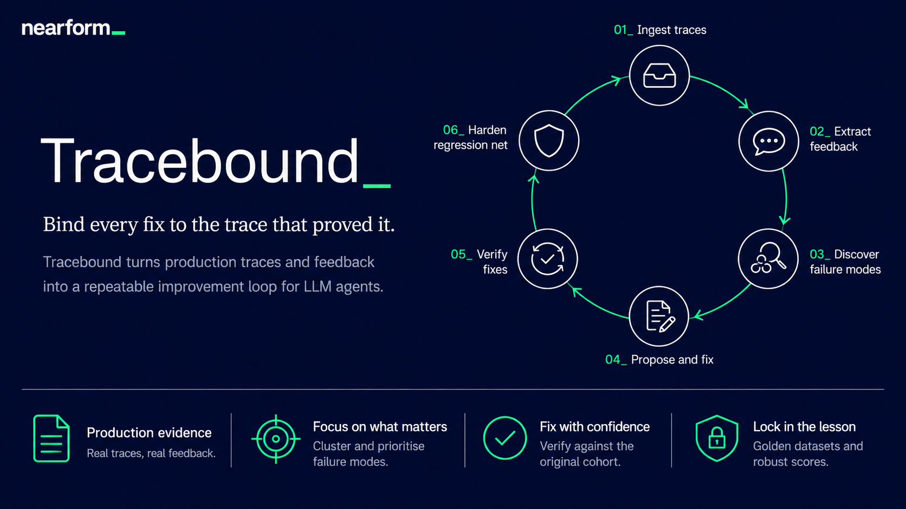
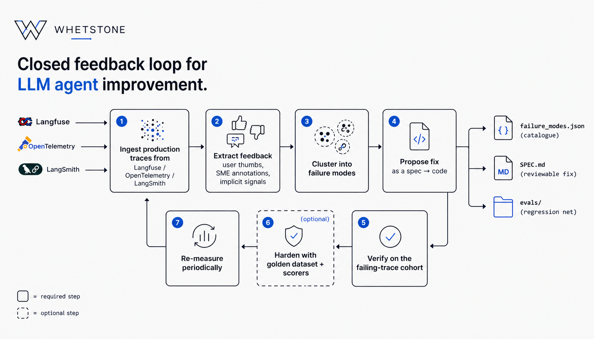

# Whetstone



**Whetstone closes the loop between your LLM agent in production and the next fix you ship.**

## The problem

Teams ship LLM agents and then operate them blind. Telemetry is collected but rarely closed back into the development loop. Failure modes get discovered ad-hoc, usually by one engineer scrolling Langfuse on a Friday afternoon. Fixes are one-off, and rarely regression-tested against the trace that motivated them. Expensive SME review effort gets thrown away after a single Slack comment.

## What Whetstone does

Whetstone ingests production traces from any telemetry source, harvests feedback from users and subject-matter experts, and clusters recurring failures into a persistent, versioned catalogue that lives as a diffable file in your repo. For every failure mode, a coding agent drafts a fix spec you review *before* code is touched, implements the change in your working tree, and replays the original failing cohort against the patched agent to confirm the fix actually worked. Every state transition is human-reviewed; nothing gets committed, pushed, or merged without you.

```
ingest traces → extract feedback → cluster failure modes → propose fix → verify → (optionally) harden
```

Whetstone is opinionated about the *workflow* and agnostic about the telemetry source, feedback signal, agent framework, and test infrastructure.

---

## How it works




Whetstone has two parts:

- **A CLI** — deterministic primitives: scaffold, validate, query. Stateless, fast, used as a subroutine by the skills and by you.
- **Agent skills** — LLM-driven judgment work. Each skill is a `.md` file that an AI coding agent (e.g. GitHub Copilot, Cursor, Claude) reads and follows. Skills call the CLI as a subroutine.

Everything lives as diffable files in your repo under a `whetstone/` folder. No server, no database.

---
## Installation

```bash
npm install -g @whetstone/cli
```

Or use without installing:

```bash
npx @whetstone/cli <command>
```

---

## Quick start

### 1. Scaffold your project

Run this inside the repo that contains your agent:

```bash
whetstone init
```

This creates:

```
whetstone/
├── whetstone.config.md      # edit this first
├── failure_modes.json       # starts empty
├── traces/                  # drop JSONL files here
├── failure_modes/           # one folder per failure mode
└── adapters/                # converter scripts go here
```

### 2. Configure the project

Edit `whetstone/whetstone.config.md`. At minimum fill in:

- **Agent under test** — repo root, entry point, framework.
- **Sanity checks** — `npm run typecheck`, `npm run lint`, `npm test`, or whatever your project uses.
- **Model test command** — a CLI that accepts `--input "<message>"` and invokes your live agent. Used by `implement-failure-mode` to verify fixes.
- **Hard rules** — constraints the coding agent must never violate (e.g. "never edit `src/payments/**` without human review").

### 3. Import traces

Write or generate an adapter script under `whetstone/adapters/` that reads your telemetry provider's export and writes Whetstone-format JSONL to `whetstone/traces/`.

The `create-adapter` skill can generate this script from a sample of your data:

> "Create a Whetstone adapter for this Langfuse JSON export: `<paste sample>`"

Each line in the output JSONL is a **Trace**:

```jsonc
{
  "id": "trc_abc123",
  "input": "Can you cancel my order?",
  "output": "I've cancelled order #5551. You'll get a confirmation email shortly.",
  "feedback": [{ "sentiment": "negative", "source": "sme", "comment": "No cancel tool exists — hallucinated side-effect." }],
  "originalTraceFile": "original/trc_abc123.json",
  "failureModeIds": [],
  "analysis": { "status": "pending" }
}
```

### 4. Discover failure modes

Point the `analyze-traces` skill at a trace file:

> "Run analyze-traces on `whetstone/traces/langfuse-2026-04-26.jsonl`"

The skill processes negatively-signalled traces in configurable batches, clusters them into failure modes, writes `failure_modes.json`, and validates after every batch. It self-corrects on validation errors.

```jsonc
// failure_modes.json
{
  "failureModes": [
    {
      "id": "fm_2026_04_hallucinated_action",
      "title": "Hallucinated side-effect confirmations",
      "description": "Agent confirms destructive actions (cancellations, refunds) it has no tool to perform.",
      "status": "discovered",
      "severity": "high",
      "tags": ["hallucination", "tool-use"],
      "discoveredAt": "2026-04-26T14:30:00Z",
      "lastUpdated": "2026-04-26T14:30:00Z",
      "affectedTraces": [{ "filename": "langfuse-2026-04-26.jsonl", "traceId": "trc_abc123" }]
    }
  ]
}
```

### 5. Research and spec a fix

Hand a failure mode id to the `research-failure-mode` skill:

> "Research fm_2026_04_hallucinated_action"

The skill reads the cohort, reads the agent source, forms hypotheses, then writes `whetstone/failure_modes/fm_2026_04_hallucinated_action/SPEC.md` — a structured fix spec with root cause, proposed changes, acceptance criteria, and a test plan.

**You review the spec before any code is touched.** When you're happy, tell the skill to mark it approved (or edit `status` in `failure_modes.json` yourself to `fix_approved`).

### 6. Implement and verify

> "Implement fm_2026_04_hallucinated_action"

The `implement-failure-mode` skill reads the approved spec, writes a `PLAN.md`, makes the code changes, runs your sanity checks, then invokes the live agent with inputs derived from the failure mode's cohort to confirm the failure is resolved. Status moves to `verified`.

---

## CLI reference

```
whetstone <command> [options]

Commands:
  init                 Scaffold the whetstone/ folder in the current repo.
  validate             Validate the whetstone/ tree against schemas + invariants.
  status               Print catalogue health + pending-trace counts.
  trace get <id>       Find a trace by id across all traces/*.jsonl files.
  fm get <id>          Print a failure mode by id from failure_modes.json.

Global options:
  -h, --help           Show this help.
  -v, --version        Print the CLI version.
```

### `whetstone init`

Scaffolds the `whetstone/` folder. Pre-existing files are left untouched.

```
Options:
  -C, --cwd <path>   Directory to initialise inside (default: cwd)
```

### `whetstone validate`

Checks structure, schemas, and invariants:

- Required files and folders exist (`whetstone.config.md`, `failure_modes.json`, `traces/`, `failure_modes/`, `adapters/`).
- `failure_modes.json` parses against the `FailureModesFile` schema.
- Every `traces/*.jsonl` line parses against the `Trace` schema.
- Failure mode ids are unique.
- `affectedTraces[]` entries point to files and trace ids that exist.
- Bidirectional links: every `affectedTraces[n].traceId` has a backlink in `failureModeIds[]`, and vice versa.
- No duplicate `(filename, traceId)` entries within a failure mode.

```
Options:
  -C, --cwd <path>   Directory to validate (default: cwd)
  --json             Emit a structured JSON report

Exit codes:
  0   passed
  1   validation issues found
  2   could not run (IO error, missing whetstone/)
```

### `whetstone status`

Prints catalogue health at a glance: failure-mode counts by lifecycle status, recently updated failure modes, specs awaiting approval, and per-file trace counts.

```
Options:
  -C, --cwd <path>   Directory to inspect (default: cwd)
  --json             Emit structured JSON

Exit codes:
  0   report printed
  2   could not run
```

### `whetstone trace get <id>`

Scans all `traces/*.jsonl` files and prints the first trace whose `id` matches.

```
Options:
  -C, --cwd <path>   Directory to inspect (default: cwd)
  --json             Emit the raw JSON object

Exit codes:
  0   found
  1   not found
  2   could not run
```

### `whetstone fm get <id>`

Looks up a failure mode by id in `failure_modes.json` and prints it.

```
Options:
  -C, --cwd <path>   Directory to inspect (default: cwd)
  --json             Emit the raw JSON object

Exit codes:
  0   found
  1   not found
  2   could not run
```

---

## Skills reference

Skills are instruction files for your AI coding agent. Drop the `skills/` folder into your agent's context or reference individual files.

| Skill | Trigger phrase | What it does |
|---|---|---|
| `analyze-traces` | "Analyze `traces/foo.jsonl`" | Clusters negatively-signalled traces into failure modes; writes `failure_modes.json`. |
| `research-failure-mode` | "Research `fm_…`" | Investigates root cause, reads source, drafts `SPEC.md`. Read-only against agent code. |
| `implement-failure-mode` | "Implement `fm_…`" | Applies an approved spec, runs sanity checks, verifies fix against the live agent. |
| `create-adapter` | "Create an adapter for this Langfuse export" | Generates a converter script from a sample of your telemetry data. |

All skills:
- Run `whetstone validate` as a preflight check and refuse to proceed on a broken catalogue.
- Quote the **Hard rules** from `whetstone.config.md` before doing any work.
- Never commit, push, or open PRs — they leave the working tree ready and stop.

---

## Sponsors

This project is sponsored by [Nearform](https://nearform.com/).

## License

[MIT](LICENSE)